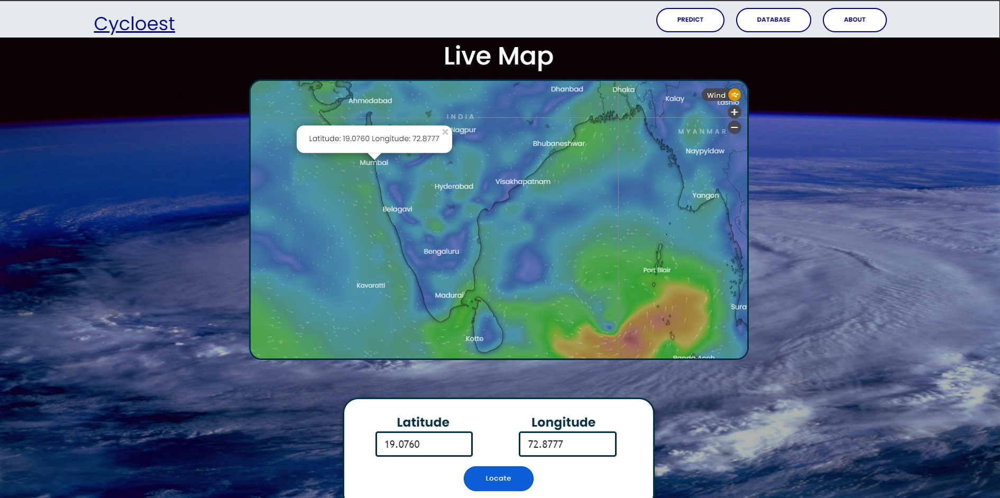

# cie-deeplearning
## Cyclone Intensity Estimation using Deep Learning

A Deep learning web app to estimate cyclone intensity estimation using INSAT-3D satellite data as there is need of automated and reliable method.
The  user can upload INSAT-3D IR Satellite Image of Cyclone which is then passed to our Deep Convolutional Neural Network ensembel model which is trained on Cyclone imagery of various intensities on the dataset from  Raw INSAT-3D satellite captured images on MOSDAC server.

 The user can also enter metadata values like date time and latitudinal position for the cyclonic event, which will be stored in a database and used to build an archive of past cyclonic events. Users can view the past events and associated metadata in the archive and visualize the localized imagery. The Flask web framework is used to integrate the web application in Python. Overall, this application uses image processing, deep learning, and database integration to provide users with accurate and timely information about cyclonic events.

## Dataset 
[Dataset link](https://www.kaggle.com/datasets/sshubam/insat3d-infrared-raw-cyclone-images-20132021)

## Technology Used

## Tech Stack Used

Front-end: HTML , CSS, Bootstrap and JavaScript

Back-end: PostgreSQL, Flask, psycopg2 and Python

Deep-learning-pipeline: Tensorlfow

Model used : [1] Mobilenet V2
[2] VGG16
[3] Inception
[4] Xception

``Home section:`` First  Page of the website

``Form section:`` used to pass the image to the model which computes intensity and forwards input data to the  database

``Live Weather Map:`` made using Windy API, showing live wind patterns and redirects the map to the coordinates recieved as input, incase of a cyclone, highlights the area with strong wind pattern

``Archive Table:`` displaying all previously uploaded data stored in database

``Submitted Image:`` Would be displayed as

